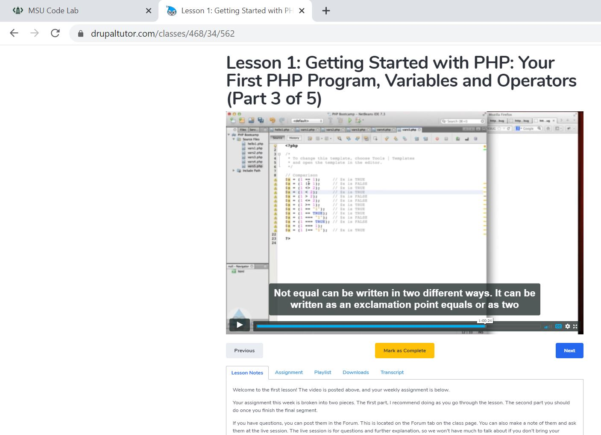

# PHP Intro Video

For work, my boss had the development team take a few online lessons on DrupalTutor.com:
1. PHP Bootcamp
2. Module Development for Drupal 7
3. Theme Development for Drupal 7 

Our website was created using Drupal 7, so these were all important skills for us to know. The PHP class was two weeks long while the two development courses were six weeks long individually. For the purpose of this assignment, I decided to review one of the PHP course videos since it was one of the more recent tech-related skills I've learned. The video is only available to paying students, so I took the liberty of screenshotting proof below of its existence:


Found at this link: [Getting Started with PHP](https://www.drupaltutor.com/classes/468/34/562)

## Basic PHP Structure
Quite a bit of familiar things in this section. He explained how to setup a PHP file with 

``` php
<?php
/* 
 * PHP Assignment 1
 * Rachel Lazzaro
 * Assignment Date
 */
>
```
With the HTML below the code as desired. We also discussed how to declare variables and that PHP recognizes them by the '$' in front of the name

## Conditionals and Functions
A lot of the lecture about conditionals and functions was recognizable from all the object-oriented programming languages I've worked with in the past. For the assignment, we needed to create a PHP program which:

- [x] said "Good Morning" before noon
- [x] said "Good Afternoon" from 12:00 - 6:00
- [x]  said "Good Evening" from 6:00 - midnight
- [x]  utilized PHP's built-in *date()* function

It didn't take long; I created a simple program which called a getTime() function. In this function, I had multiple conditionals based on the time I pulled from the date() function, and then outputted the desired phrase.


If you'd like more information on my experience with the course, or if you have any good memes you've found recently, please create an [Issue](https://github.com/lazzaror/MI-449-misc-markdown/issues)!
